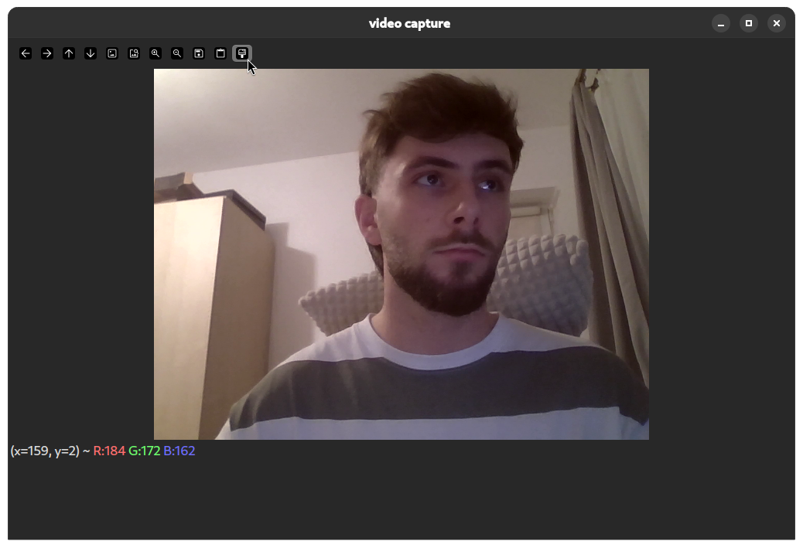

# OpenCV webcam effects

This is a simple app to fetch a stream of your webcam and apply some simple effects. It is written in Rust using
the **opencv-rust** crate.

It also supports writing a H.264 WebRTC stream that can be opened in a browser or embedded in a webpage for viewing
in real time.

## Building and running

To build this, you need to have [Rust nightly installed](https://www.rust-lang.org/tools/install).

After setting up `rust-nightly` you can run this project using `cargo run --bin opencv` or `cargo run --bin imageproc` 
for each of the two implementations.

[OpenCV](https://github.com/opencv/opencv/releases/latest) also needs to be installed system-wide along with
[GStreamer](https://gstreamer.freedesktop.org/download/) and [MediaMTX](https://github.com/bluenviron/mediamtx/) for
the WebRTC livestream.

For the effects checkboxes in the OpenCV implementation, you need to click the paint brush button in the toolbar:



The WebRTC stream can be found at `rtsp://localhost:8889/mystream`

## Installing Dependencies

### Ubuntu

```
git clone http://github.com/bertin0/challenge
cd challenge
sudo apt install opencv libgstrtspserver-1.0-dev gstreamer1.0-rtsp
curl https://sh.rustup.rs -sSf | sh
wget https://github.com/bluenviron/mediamtx/releases/download/v1.11.3/mediamtx_v1.11.3_linux_amd64.tar.gz
tar xvf mediamtx*.tar.gz
./mediamtx
cargo run --bin opencv
```

### Arch Linux

```
git clone http://github.com/bertin0/challenge
cd challenge
paru -Syu rustup opencv gstreamer gst-rtsp-server opencv mediamtx-bin
sudo systemctl start mediamtx
rustup install nightly
cargo run --bin opencv
```

# Usage example


